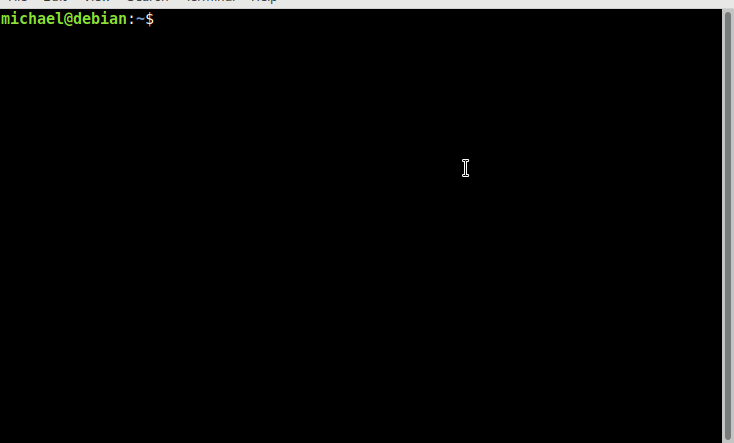
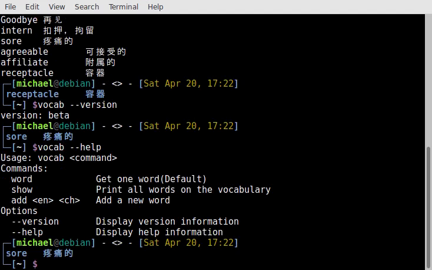

# zsh-vocab
Have you ever think of a software or a plugin that allows you to recite words at any time?
Though this tool can't allow you to recite word at any time, it allows you to recite words when using zsh!(Or other powerful shell)
## Version
1.05

## Demo

## screenshots

## Installation

You can execute this program manually by

    python3 vocab.py [args]
Or, you can add it to your shellrc like(That's exactly what I do)

    function vocab {
        python3 ~/vocabulary/main.py $*
    }
You can add a file to /bin, like /bin/vocab as well

    python3 ~/vocabulary/main.py $*

## Automation
Add the following to your zsh(Or other shell)'s theme

    $(vocab)
or

    $(python3 ~/vocabulary/main.py)

That's my zsh's theme

    PROMPT=$'%{\e[0;34m%}%B┌─[%b%{\e[0m%}%{\e[1;32m%}%n%{\e[1;30m%}@%{\e[0m%}%{\e[0;36m%}%m%{\e[0;34m%}%B]%b%{\e[0m%} - <$(git_prompt_info)> - %{\e[0;34m%}%B[%b%{\e[0;33m%}'%D{"%a %b %d, %H:%M"}%b$'%{\e[0;34m%}%B]%b%{\e[0m%}$(if [ $temp ]; then echo ;echo -ne "\033[0;34m%B│"; echo temp:$temp; fi)
    %{\e[0;34m%}%B│$(vocab)
    %{\e[0;34m%}%B└─%b%{\e[0;34m%}%B[%b%{\e[1;37m%}%~%b%{\e[0;34m%}%B] %{\e[1;35m%}$%{\e[0m%}%b'

## Download word list
Create a json file according to the format shown in python3 main.py --help, and then copy to ~/.vocab/data.json.
If you would like a commonly used list(CET 4/6, TOEFL, IELTS) and you have a word list of some other format, you can create a issue and I'll add the word list to a branch.

## Enviorment
Language: Python3
System: debian9
This repo only supports Python3 now. It may supports Python2 in the future.
This repo supports debian 9(My PC), other Linux systems haven't be tested. Other systems like Windows or Mac-os haven't be tested either.

## Other things
For any advices or bugs founded, just create a new issue or a pull request.
